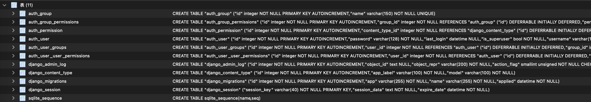

# 第一部分: 基本操作

参考: https://docs.djangoproject.com/en/4.2/intro/tutorial01/

```bash
$ docker run -ti --rm --name my-first-django \
-p 0.0.0.0:8000:8000 \
-v ~/work/code/py_code/django/django-tutorial-4.2:/django-tutorial-4.2 \
-w /django-tutorial-4.2 \
python:3.10-bullseye \
bash

# 安装依赖
$ pip install -i https://pypi.tuna.tsinghua.edu.cn/simple -r requirements.txt

# 创建项目
$ django-admin startproject mysite
$ tree -a ./mysite
./mysite
├── manage.py
└── mysite
    ├── __init__.py
    ├── asgi.py
    ├── settings.py
    ├── urls.py
    └── wsgi.py

2 directories, 6 files
$

# 在创建应用之前确认数据库中存在的 table
# 将 models 转为 SQL
$ python manage.py makemigrations
No changes detected

$ tree -a ./mysite
./mysite
├── db.sqlite3  # 增加数据库
├── manage.py
└── mysite
    ├── __init__.py
    ├── asgi.py
    ├── settings.py
    ├── urls.py
    └── wsgi.py

2 directories, 7 files

# 在数据库中执行 SQL
$ python manage.py migrate
Operations to perform:
  Apply all migrations: admin, auth, contenttypes, sessions
Running migrations:
  Applying contenttypes.0001_initial... OK
  Applying auth.0001_initial... OK
  Applying admin.0001_initial... OK
  Applying admin.0002_logentry_remove_auto_add... OK
  Applying admin.0003_logentry_add_action_flag_choices... OK
  Applying contenttypes.0002_remove_content_type_name... OK
  Applying auth.0002_alter_permission_name_max_length... OK
  Applying auth.0003_alter_user_email_max_length... OK
  Applying auth.0004_alter_user_username_opts... OK
  Applying auth.0005_alter_user_last_login_null... OK
  Applying auth.0006_require_contenttypes_0002... OK
  Applying auth.0007_alter_validators_add_error_messages... OK
  Applying auth.0008_alter_user_username_max_length... OK
  Applying auth.0009_alter_user_last_name_max_length... OK
  Applying auth.0010_alter_group_name_max_length... OK
  Applying auth.0011_update_proxy_permissions... OK
  Applying auth.0012_alter_user_first_name_max_length... OK
  Applying sessions.0001_initial... OK

```

数据库中存在以下数据表


```bash
find . -name __pycache__ -type d -exec rm -rf {} \;

# 启动服务
python manage.py runserver 0.0.0.0:8000

# 创建应用
$ python manage.py startapp polls
$ tree -a ./mysite
./mysite
├── db.sqlite3
├── manage.py
├── mysite
│   ├── __init__.py
│   ├── asgi.py
│   ├── settings.py
│   ├── urls.py
│   └── wsgi.py
└── polls
    ├── __init__.py
    ├── admin.py
    ├── apps.py
    ├── migrations
    │   └── __init__.py
    ├── models.py
    ├── tests.py
    └── views.py

4 directories, 14 files
```

# 第二部分: Logging

* https://docs.djangoproject.com/en/4.2/topics/logging/
* https://pymotw.com/3/logging/index.html

Logging 默认配置

```bash
####################################################################

diff --git a/mysite/manage.py b/mysite/manage.py
index a7da667..9c071de 100755
--- a/mysite/manage.py
+++ b/mysite/manage.py
@@ -2,6 +2,7 @@
 """Django's command-line utility for administrative tasks."""
 import os
 import sys
+from logging_tree import printout


 def main():
@@ -19,4 +20,8 @@ def main():


 if __name__ == '__main__':
+    printout()
+    print(
+        "************************************ manage.py ************************************"
+    )
     main()
(END)

####################################################################

$ python manage.py runserver 0.0.0.0:8000
<--""
   Level WARNING
************************************ manage.py ************************************
<--""
   Level WARNING
************************************ manage.py ************************************
Watching for file changes with StatReloader
Performing system checks...

System check identified no issues (0 silenced).
March 16, 2024 - 04:32:14
Django version 4.2.11, using settings 'mysite.settings'
Starting development server at http://0.0.0.0:8000/
Quit the server with CONTROL-C.

```

```python
# Logging 增加配置

LOGGING = {
    "version": 1,
    "disable_existing_loggers": False,
    "handlers": {
        "console": {
            "class": "logging.StreamHandler",
        },
    },
    "root": {
        "handlers": ["console"],
        "level": "WARNING",
    },
    "loggers": {
        "django.request": {
            "handlers": ["console"],
            "level": "DEBUG",
            "propagate": False,
        },
        "django.db": {
            "handlers": ["console"],
            "level": "DEBUG",
            "propagate": False,
        },
        "django.dispatch": {
            "handlers": ["console"],
            "level": "DEBUG",
            "propagate": False,
        }
    },
}

# 访问 http://127.0.0.1:8000/polls/

<--""
   Level WARNING
   Handler Stream <_io.TextIOWrapper name='<stderr>' mode='w' encoding='utf-8'>
   |
   o<--"asyncio"
   |   Level NOTSET so inherits level WARNING
   |
   o<--[concurrent]
   |   |
   |   o<--"concurrent.futures"
   |       Level NOTSET so inherits level WARNING
   |
   o<--"django"
       Level INFO
       Handler Stream <_io.TextIOWrapper name='<stderr>' mode='w' encoding='utf-8'>
         Level INFO
         Filter <django.utils.log.RequireDebugTrue object at 0x7f46a04f82e0>
       Handler <AdminEmailHandler (ERROR)>
         Level ERROR
         Filter <django.utils.log.RequireDebugFalse object at 0x7f46a04fa980>
       |
       o   "django.db"
       |   Level DEBUG
       |   Propagate OFF
       |   Handler Stream <_io.TextIOWrapper name='<stderr>' mode='w' encoding='utf-8'>
       |   |
       |   o<--"django.db.backends"
       |   |   Level NOTSET so inherits level DEBUG
       |   |   |
       |   |   o<--"django.db.backends.base"
       |   |   |   Level NOTSET so inherits level DEBUG
       |   |   |
       |   |   o<--"django.db.backends.schema"
       |   |       Level NOTSET so inherits level DEBUG
       |   |
       |   o<--"django.db.models"
       |       Level NOTSET so inherits level DEBUG
       |
       o   "django.dispatch"
       |   Level DEBUG
       |   Propagate OFF
       |   Handler Stream <_io.TextIOWrapper name='<stderr>' mode='w' encoding='utf-8'>
       |
       o   "django.request"
       |   Level DEBUG
       |   Propagate OFF
       |   Handler Stream <_io.TextIOWrapper name='<stderr>' mode='w' encoding='utf-8'>
       |
       o<--[django.security]
       |   |
       |   o<--"django.security.csrf"
       |       Level NOTSET so inherits level INFO
       |
       o   "django.server"
       |   Level INFO
       |   Propagate OFF
       |   Handler Stream <_io.TextIOWrapper name='<stderr>' mode='w' encoding='utf-8'>
       |     Level INFO
       |     Formatter <django.utils.log.ServerFormatter object at 0x7f46a0558b80>
       |
       o<--"django.template"
       |   Level NOTSET so inherits level INFO
       |
       o<--[django.utils]
           |
           o<--"django.utils.autoreload"
               Level NOTSET so inherits level INFO

```

# 第三部分: Models and databases

* https://docs.djangoproject.com/en/4.2/topics/db/

## How to provide initial data for models

    * https://docs.djangoproject.com/en/4.2/howto/initial-data/

    * https://docs.djangoproject.com/en/4.2/topics/db/fixtures/

```bash
root@d9641a2af30b:/django-tutorial-4.2/mysite# python manage.py loaddata sample
<--""
   Level WARNING
************************************ manage.py ************************************
(0.000) BEGIN; args=None; alias=default
(0.000) PRAGMA foreign_keys = OFF; args=None; alias=default
(0.000) PRAGMA foreign_keys; args=None; alias=default
(0.002) UPDATE "myapp_person" SET "first_name" = 'John', "last_name" = 'Lennon' WHERE "myapp_person"."id" = 1; args=('John', 'Lennon', 1); alias=default
(0.000) UPDATE "myapp_person" SET "first_name" = 'Paul', "last_name" = 'McCartney' WHERE "myapp_person"."id" = 2; args=('Paul', 'McCartney', 2); alias=default
(0.000) PRAGMA foreign_key_check("myapp_person"); args=None; alias=default
Installed 2 object(s) from 1 fixture(s)
(0.000) COMMIT; args=None; alias=default
root@d9641a2af30b:/django-tutorial-4.2/mysite#
root@d9641a2af30b:/django-tutorial-4.2/mysite# python manage.py loaddata /django-tutorial-4.2/mysite/myapp/fixtures/sample.json
<--""
   Level WARNING
************************************ manage.py ************************************
(0.000) BEGIN; args=None; alias=default
(0.000) PRAGMA foreign_keys = OFF; args=None; alias=default
(0.000) PRAGMA foreign_keys; args=None; alias=default
(0.002) UPDATE "myapp_person" SET "first_name" = 'John', "last_name" = 'Lennon' WHERE "myapp_person"."id" = 1; args=('John', 'Lennon', 1); alias=default
(0.000) UPDATE "myapp_person" SET "first_name" = 'Paul', "last_name" = 'McCartney' WHERE "myapp_person"."id" = 2; args=('Paul', 'McCartney', 2); alias=default
(0.000) PRAGMA foreign_key_check("myapp_person"); args=None; alias=default
Installed 2 object(s) from 1 fixture(s)
(0.000) COMMIT; args=None; alias=default
root@d9641a2af30b:/django-tutorial-4.2/mysite#
```

# 第四部分: settings

```bash
root@2837a3ba341d:/django-tutorial-4.2/mysite# python manage.py shell
<--""
   Level WARNING
************************************ manage.py ************************************
Python 3.10.18 (main, Jul  1 2025, 05:26:33) [GCC 10.2.1 20210110] on linux
Type "help", "copyright", "credits" or "license" for more information.
(InteractiveConsole)
>>>
>>> from django.conf import settings
>>>
>>> dir(settings)
ABSOLUTE_URL_OVERRIDES
ADMINS
ALLOWED_HOSTS
APPEND_SLASH
AUTHENTICATION_BACKENDS
AUTH_PASSWORD_VALIDATORS
AUTH_USER_MODEL
BASE_DIR
CACHES
CACHE_MIDDLEWARE_ALIAS
CACHE_MIDDLEWARE_KEY_PREFIX
CACHE_MIDDLEWARE_SECONDS
CSRF_COOKIE_AGE
CSRF_COOKIE_DOMAIN
CSRF_COOKIE_HTTPONLY
CSRF_COOKIE_MASKED
CSRF_COOKIE_NAME
CSRF_COOKIE_PATH
CSRF_COOKIE_SAMESITE
CSRF_COOKIE_SECURE
CSRF_FAILURE_VIEW
CSRF_HEADER_NAME
CSRF_TRUSTED_ORIGINS
CSRF_USE_SESSIONS
DATABASES
DATABASE_ROUTERS
DATA_UPLOAD_MAX_MEMORY_SIZE
DATA_UPLOAD_MAX_NUMBER_FIELDS
DATA_UPLOAD_MAX_NUMBER_FILES
DATETIME_FORMAT
DATETIME_INPUT_FORMATS
DATE_FORMAT
DATE_INPUT_FORMATS
DEBUG
DEBUG_PROPAGATE_EXCEPTIONS
DECIMAL_SEPARATOR
DEFAULT_AUTO_FIELD
DEFAULT_CHARSET
DEFAULT_EXCEPTION_REPORTER
DEFAULT_EXCEPTION_REPORTER_FILTER
DEFAULT_FILE_STORAGE
DEFAULT_FROM_EMAIL
DEFAULT_INDEX_TABLESPACE
DEFAULT_TABLESPACE
DISALLOWED_USER_AGENTS
EMAIL_BACKEND
EMAIL_HOST
EMAIL_HOST_PASSWORD
EMAIL_HOST_USER
EMAIL_PORT
EMAIL_SSL_CERTFILE
EMAIL_SSL_KEYFILE
EMAIL_SUBJECT_PREFIX
EMAIL_TIMEOUT
EMAIL_USE_LOCALTIME
EMAIL_USE_SSL
EMAIL_USE_TLS
FILE_UPLOAD_DIRECTORY_PERMISSIONS
FILE_UPLOAD_HANDLERS
FILE_UPLOAD_MAX_MEMORY_SIZE
FILE_UPLOAD_PERMISSIONS
FILE_UPLOAD_TEMP_DIR
FIRST_DAY_OF_WEEK
FIXTURE_DIRS
FORCE_SCRIPT_NAME
FORMAT_MODULE_PATH
FORM_RENDERER
IGNORABLE_404_URLS
INSTALLED_APPS
INTERNAL_IPS
LANGUAGES
LANGUAGES_BIDI
LANGUAGE_CODE
LANGUAGE_COOKIE_AGE
LANGUAGE_COOKIE_DOMAIN
LANGUAGE_COOKIE_HTTPONLY
LANGUAGE_COOKIE_NAME
LANGUAGE_COOKIE_PATH
LANGUAGE_COOKIE_SAMESITE
LANGUAGE_COOKIE_SECURE
LOCALE_PATHS
LOGGING
LOGGING_CONFIG
LOGIN_REDIRECT_URL
LOGIN_URL
LOGOUT_REDIRECT_URL
MANAGERS
MEDIA_ROOT
MEDIA_URL
MESSAGE_STORAGE
MIDDLEWARE
MIGRATION_MODULES
MONTH_DAY_FORMAT
NUMBER_GROUPING
PASSWORD_HASHERS
PASSWORD_RESET_TIMEOUT
PREPEND_WWW
ROOT_URLCONF
SECRET_KEY
SECRET_KEY_FALLBACKS
SECURE_CONTENT_TYPE_NOSNIFF
SECURE_CROSS_ORIGIN_OPENER_POLICY
SECURE_HSTS_INCLUDE_SUBDOMAINS
SECURE_HSTS_PRELOAD
SECURE_HSTS_SECONDS
SECURE_PROXY_SSL_HEADER
SECURE_REDIRECT_EXEMPT
SECURE_REFERRER_POLICY
SECURE_SSL_HOST
SECURE_SSL_REDIRECT
SERVER_EMAIL
SESSION_CACHE_ALIAS
SESSION_COOKIE_AGE
SESSION_COOKIE_DOMAIN
SESSION_COOKIE_HTTPONLY
SESSION_COOKIE_NAME
SESSION_COOKIE_PATH
SESSION_COOKIE_SAMESITE
SESSION_COOKIE_SECURE
SESSION_ENGINE
SESSION_EXPIRE_AT_BROWSER_CLOSE
SESSION_FILE_PATH
SESSION_SAVE_EVERY_REQUEST
SESSION_SERIALIZER
SETTINGS_MODULE
SHORT_DATETIME_FORMAT
SHORT_DATE_FORMAT
SIGNING_BACKEND
SILENCED_SYSTEM_CHECKS
STATICFILES_DIRS
STATICFILES_FINDERS
STATICFILES_STORAGE
STATIC_ROOT
STATIC_URL
STORAGES
TEMPLATES
TEST_NON_SERIALIZED_APPS
TEST_RUNNER
THOUSAND_SEPARATOR
TIME_FORMAT
TIME_INPUT_FORMATS
TIME_ZONE
USE_DEPRECATED_PYTZ
USE_I18N
USE_L10N
USE_THOUSAND_SEPARATOR
USE_TZ
USE_X_FORWARDED_HOST
USE_X_FORWARDED_PORT
WSGI_APPLICATION
X_FRAME_OPTIONS
YEAR_MONTH_FORMAT
__class__
__delattr__
__dict__
__dir__
__doc__
__eq__
__format__
__ge__
__getattribute__
__gt__
__hash__
__init__
__init_subclass__
__le__
__lt__
__module__
__ne__
__new__
__reduce__
__reduce_ex__
__repr__
__setattr__
__sizeof__
__str__
__subclasshook__
__weakref__
_explicit_settings
is_overridden
>>>
>>> settings.BASE_DIR
PosixPath('/django-tutorial-4.2/mysite')
>>>
>>> settings.SECRET_KEY
'django-insecure-3y!u+@od^elqgb%(y6#(rdue!pk%cq@v-9u$%5t$#9nmczn3n#'
>>>
>>> settings.DEBUG
True
>>>
>>> settings.ALLOWED_HOSTS
[]
>>>
>>> settings.INSTALLED_APPS
[
    'django.contrib.admin',
    'django.contrib.auth',
    'django.contrib.contenttypes',
    'django.contrib.sessions',
    'django.contrib.messages',
    'django.contrib.staticfiles',
    'polls.apps.PollsConfig',
    'myapp.apps.MyappConfig',
    'myapp2.apps.Myapp2Config'
]
>>>
>>> settings.MIDDLEWARE
[
    'django.middleware.security.SecurityMiddleware',
    'django.contrib.sessions.middleware.SessionMiddleware',
    'django.middleware.common.CommonMiddleware',
    'django.middleware.csrf.CsrfViewMiddleware',
    'django.contrib.auth.middleware.AuthenticationMiddleware',
    'django.contrib.messages.middleware.MessageMiddleware',
    'django.middleware.clickjacking.XFrameOptionsMiddleware'
]
>>>
>>> settings.ROOT_URLCONF
'mysite.urls'
>>>
>>> settings.TEMPLATES
[
    {
        'BACKEND': 'django.template.backends.django.DjangoTemplates',
        'DIRS': [],
        'APP_DIRS': True,
        'OPTIONS': {
            'context_processors': [
                'django.template.context_processors.debug',
                'django.template.context_processors.request',
                'django.contrib.auth.context_processors.auth',
                'django.contrib.messages.context_processors.messages'
            ]
        }
    }
]
>>>
>>> settings.WSGI_APPLICATION
'mysite.wsgi.application'
>>>
>>> settings.DATABASES
{
    'default': {
        'ENGINE': 'django.db.backends.sqlite3',
        'NAME': PosixPath('/django-tutorial-4.2/mysite/db.sqlite3'),
        'ATOMIC_REQUESTS': False,
        'AUTOCOMMIT': True,
        'CONN_MAX_AGE': 0,
        'CONN_HEALTH_CHECKS': False,
        'OPTIONS': {},
        'TIME_ZONE': None,
        'USER': '',
        'PASSWORD': '',
        'HOST': '',
        'PORT': '',
        'TEST': {
            'CHARSET': None,
            'COLLATION': None,
            'MIGRATE': True,
            'MIRROR': None,
            'NAME': None
        }
    }
}
>>>
>>> settings.AUTH_PASSWORD_VALIDATORS
[
    {'NAME': 'django.contrib.auth.password_validation.UserAttributeSimilarityValidator'},
    {'NAME': 'django.contrib.auth.password_validation.MinimumLengthValidator'},
    {'NAME': 'django.contrib.auth.password_validation.CommonPasswordValidator'},
    {'NAME': 'django.contrib.auth.password_validation.NumericPasswordValidator'}
]
>>>
>>> settings.LOGGING
{
    'version': 1,
    'disable_existing_loggers': False,
    'handlers': {
        'console': {
            'class': 'logging.StreamHandler'
        }
    },
    'root': {
        'handlers': ['console'],
        'level': 'WARNING'
    },
    'loggers': {
        'django.request': {
            'handlers': ['console'],
            'level': 'DEBUG',
            'propagate': False
        },
        'django.db': {
            'handlers': ['console'],
            'level': 'DEBUG',
            'propagate': False
        },
        'django.dispatch': {
            'handlers': ['console'],
            'level': 'DEBUG',
            'propagate': False
        }
    }
}
>>>

```

# 第五部分: admin

* https://docs.djangoproject.com/en/4.2/intro/tutorial02/

# 第六部分：URL

```bash
pip install -i https://pypi.tuna.tsinghua.edu.cn/simple django-extensions==3.2.3

# 在配置文件中增加应用

* [URL dispatcher](https://docs.djangoproject.com/en/4.2/topics/http/urls/)

root@2837a3ba341d:/django-tutorial-4.2/mysite# python manage.py show_urls
<--""
   Level WARNING
************************************ manage.py ************************************
/admin/	django.contrib.admin.sites.index	admin:index
/admin/<app_label>/	django.contrib.admin.sites.app_index	admin:app_list
/admin/<url>	django.contrib.admin.sites.catch_all_view
/admin/auth/group/	django.contrib.admin.options.changelist_view	admin:auth_group_changelist
/admin/auth/group/<path:object_id>/	django.views.generic.base.RedirectView
/admin/auth/group/<path:object_id>/change/	django.contrib.admin.options.change_view	admin:auth_group_change
/admin/auth/group/<path:object_id>/delete/	django.contrib.admin.options.delete_view	admin:auth_group_delete
/admin/auth/group/<path:object_id>/history/	django.contrib.admin.options.history_view	admin:auth_group_history
/admin/auth/group/add/	django.contrib.admin.options.add_view	admin:auth_group_add
/admin/auth/user/	django.contrib.admin.options.changelist_view	admin:auth_user_changelist
/admin/auth/user/<id>/password/	django.contrib.auth.admin.user_change_password	admin:auth_user_password_change
/admin/auth/user/<path:object_id>/	django.views.generic.base.RedirectView
/admin/auth/user/<path:object_id>/change/	django.contrib.admin.options.change_view	admin:auth_user_change
/admin/auth/user/<path:object_id>/delete/	django.contrib.admin.options.delete_view	admin:auth_user_delete
/admin/auth/user/<path:object_id>/history/	django.contrib.admin.options.history_view	admin:auth_user_history
/admin/auth/user/add/	django.contrib.auth.admin.add_view	admin:auth_user_add
/admin/autocomplete/	django.contrib.admin.sites.autocomplete_view	admin:autocomplete
/admin/jsi18n/	django.contrib.admin.sites.i18n_javascript	admin:jsi18n
/admin/login/	django.contrib.admin.sites.login	admin:login
/admin/logout/	django.contrib.admin.sites.logout	admin:logout
/admin/password_change/	django.contrib.admin.sites.password_change	admin:password_change
/admin/password_change/done/	django.contrib.admin.sites.password_change_done	admin:password_change_done
/admin/r/<int:content_type_id>/<path:object_id>/	django.contrib.contenttypes.views.shortcut	admin:view_on_site
/polls/	polls.views.index	index
root@2837a3ba341d:/django-tutorial-4.2/mysite#

```

测试用例：tests/urlpatterns

参考：
* https://docs.djangoproject.com/en/4.2/topics/http/urls/
* https://medium.com/@suhast_40578/url-namespacing-and-views-in-django-e792c9308366
* https://www.cnblogs.com/ZFBG/p/11521842.html

